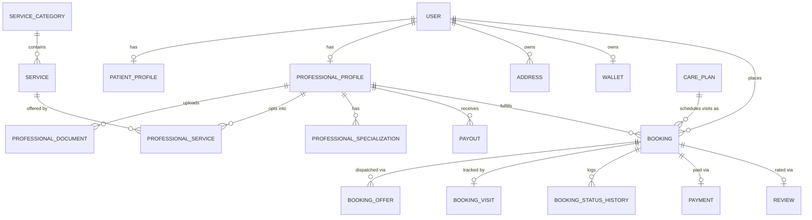

# Mendyr Backend — Architecture

Mendyr is an at-home healthcare marketplace (nurses, physiotherapists, elder/baby-care
attendants, lab technicians) connecting patients directly with verified healthcare
professionals — the same product shape as Snabbit/Urban Company, applied to home healthcare.
This document explains the codebase layout, the domain model, and the services that make up
the backend, so a new engineer can get oriented without reading every file.

Everything described here has been built, imported, migrated against a real Postgres+PostGIS
database, and smoke-tested end-to-end (signup → OTP → JWT → professional onboarding → role
checks) as part of building this scaffold. It is a real, running skeleton — not a mockup.

---

## 1. Tech stack

| Concern              | Choice                                                              |
|-----------------------|----------------------------------------------------------------------|
| API framework         | FastAPI (async)                                                     |
| Database              | PostgreSQL + PostGIS (geospatial matching), SQLAlchemy 2.0 (async ORM), plain SQL migration files (migrations/*.sql, applied by scripts/run_migrations.py) |
| Cache / queues        | Redis (OTP, rate limiting, dispatch locks), Celery (background jobs, scheduled tasks) |
| Auth                  | Phone OTP (primary) + JWT access/refresh tokens                     |
| Payments              | Razorpay (order + webhook + refund)                                 |
| SMS                   | MSG91 (pluggable provider interface; console provider for local dev) |
| Push                  | Firebase Cloud Messaging                                             |
| Storage               | S3-compatible object storage, presigned URLs (KYC docs, visit photos) |
| Observability         | structlog (JSON logs in prod), Sentry, Prometheus (`/metrics`)       |
| Testing               | pytest + pytest-asyncio + httpx.AsyncClient                         |
| Lint/format/types     | ruff, mypy                                                           |
| Dependency management | [uv](https://docs.astral.sh/uv/) — `uv.lock` pins every package to an exact version so `uv sync` installs identically on any machine |

---

## 2. Folder structure

```
Mendly-Backend/
├── app/
│   ├── main.py                  # FastAPI app factory: middleware, exception handlers, routers
│   │
│   ├── core/                    # Framework-agnostic cross-cutting concerns
│   │   ├── config.py            #   Settings (pydantic-settings, reads .env)
│   │   ├── constants.py         #   Every domain enum (mirrors Postgres native ENUM types)
│   │   ├── security.py          #   Password hashing, JWT issue/verify
│   │   ├── exceptions.py        #   AppError hierarchy + FastAPI exception handlers
│   │   ├── logging.py           #   structlog configuration
│   │   ├── middleware.py        #   Request-id + access-log middleware
│   │   ├── permissions.py       #   Role-based route guards (require_patient, require_admin, ...)
│   │   └── rate_limit.py        #   slowapi limiter (Redis-backed)
│   │
│   ├── db/                      # Database plumbing (no business logic)
│   │   ├── base_class.py        #   Declarative Base + UUID/Timestamp/SoftDelete mixins
│   │   ├── session.py           #   Async engine/sessionmaker + get_db() FastAPI dependency
│   │   ├── redis.py             #   Shared async Redis client
│   │   └── types.py             #   pg_enum() helper — see "Native enums" below
│   │
│   ├── models/                  # SQLAlchemy ORM models = the schema, one file per bounded area
│   │   ├── user.py              #   User, OTPVerification, DeviceToken
│   │   ├── patient.py           #   PatientProfile (medical context for care)
│   │   ├── professional.py      #   ProfessionalProfile, KYC docs, specializations, availability
│   │   ├── address.py           #   Geocoded patient addresses (PostGIS Geography point)
│   │   ├── service.py           #   ServiceCategory, Service, ProfessionalService (catalogue)
│   │   ├── booking.py           #   CarePlan, Booking, BookingOffer, BookingVisit, status history
│   │   ├── payment.py           #   Payment, Payout
│   │   ├── wallet.py            #   Wallet, WalletTransaction, Coupon, CouponRedemption
│   │   ├── review.py            #   Review (post-visit rating)
│   │   ├── notification.py      #   Notification (push/SMS/email/in-app log)
│   │   ├── support.py           #   SupportTicket, SupportTicketMessage
│   │   └── audit.py              #   AuditLog (admin/ops actions)
│   │
│   ├── schemas/                 # Pydantic request/response DTOs — never expose ORM models directly
│   │
│   ├── repositories/            # Thin async query layer between services and the DB
│   │   ├── base.py              #   Generic CRUD (get/list/add/delete) via a TypeVar model
│   │   ├── user_repo.py
│   │   ├── professional_repo.py #   Includes the PostGIS nearest-professional geo query
│   │   ├── booking_repo.py      #   Booking + BookingOffer queries
│   │   └── wallet_repo.py       #   Includes row-locked reads for safe balance mutation
│   │
│   ├── services/                # Business logic — see §4, "Services", below
│   │
│   ├── integrations/             # Outbound calls to third parties, isolated behind small interfaces
│   │   ├── razorpay_client.py   #   Order create, signature verify, refund
│   │   ├── s3_client.py         #   Presigned upload/download URLs
│   │   ├── sms/                 #   Provider-swappable: console (dev) | msg91 (prod)
│   │   ├── push/fcm.py          #   Firebase push
│   │   └── maps/google_maps.py  #   Geocoding + ETA
│   │
│   ├── api/v1/
│   │   ├── deps.py              #   get_current_user, pagination
│   │   ├── api.py               #   Aggregates every endpoint router
│   │   └── endpoints/           #   One file per resource (auth, bookings, offers, visits, ...)
│   │
│   └── workers/                 # Celery — background/scheduled jobs
│       ├── celery_app.py        #   App + beat schedule
│       └── tasks/                #   matching (offer-expiry sweep), payouts, reminders, notifications
│
├── migrations/                   # DB migrations — numbered, hand-written .sql files applied
│   ├── 001_extensions.sql        #   in filename order by scripts/run_migrations.py
│   ├── 002_initial_schema.sql
│   ├── ...
│   └── README.md                 #   convention + how to add a new migration
│
├── scripts/seed.py               # Idempotent reference-data seeding (categories, services, specializations)
├── tests/                        # pytest suite (unit + integration), see §7
├── docker-compose.yml            # postgres(+postgis) + redis + api + celery worker + celery beat
├── Dockerfile
├── Makefile                      # make dev / migrate / test / up / ...
├── pyproject.toml                 # project + dependency declarations (>= floors)
├── uv.lock                        # exact resolved versions — commit this, everyone gets the same install
└── .env.example
```

**Why this layering?** Each layer only knows about the one below it:
`endpoints → services → repositories → models`. Endpoints never touch the ORM or write SQL
directly; services never know about HTTP (`Request`, status codes); repositories never contain
business rules (discounts, state machines, matching logic). This makes services independently
unit-testable and keeps the HTTP layer thin enough to skim in one pass.

### Native enums (`app/db/types.py`)

Every domain enum in `app/core/constants.py` is a `StrEnum` (e.g. `UserRole.PATIENT = "patient"`).
SQLAlchemy's `Enum` type stores the Python member's `.name` in Postgres by default, which would
silently write `'PATIENT'` instead of `'patient'` — surprising for anyone querying the database
directly, and inconsistent with the constants file. `pg_enum(EnumClass, "pg_type_name")` fixes
this with `values_callable`, so every native Postgres ENUM's labels are lowercase and match the
`StrEnum` values exactly. Confirmed with `enum_range(NULL::user_role)` → `{patient,professional,admin,ops}`.

---

## 3. Domain model (30 tables)



Full list of tables (see `app/models/`): `users`, `otp_verifications`, `device_tokens`,
`patient_profiles`, `professional_profiles`, `professional_documents`, `specializations`,
`professional_specializations`, `professional_availability_slots`, `addresses`,
`service_categories`, `services`, `professional_services`, `care_plans`, `bookings`,
`booking_offers`, `booking_status_history`, `booking_visits`, `visit_tracking_pings`,
`payments`, `payouts`, `wallets`, `wallet_transactions`, `coupons`, `coupon_redemptions`,
`reviews`, `notifications`, `support_tickets`, `support_ticket_messages`, `audit_logs`.

### Key design decisions

- **Price snapshotting.** A `Booking` stores `base_price`, `platform_fee`, `tax_amount`,
  `commission_pct`, etc. as columns at creation time, not references to live catalogue rows —
  so a later price change never rewrites the cost of an already-placed booking.
- **Geospatial matching.** `addresses.location`, `professional_profiles.current_location` and
  `bookings.service_location` are PostGIS `Geography(POINT, 4326)` columns with explicit GiST
  indexes, queried via `ST_DWithin`/`ST_Distance` in `professional_repo.find_nearby_candidates`.
- **Append-only audit trail.** `booking_status_history` and `wallet_transactions` are
  insert-only ledgers; balances/statuses are derived, not the source of truth for history.
- **Care plans vs. one-time bookings.** A `CarePlan` (e.g. "7-day post-surgery care, twice
  daily") is a schedule; each visit is still its own `Booking` row, dispatched independently —
  a patient can have a different nurse show up on different days of the same plan.

---

## 4. Services (`app/services/`) — what each one owns

| Service | Responsibility |
|---|---|
| `otp_service.py` | Generates/hashes/verifies OTP codes; resend cooldown via Redis; DB-persisted for audit. |
| `auth_service.py` | OTP verify → signup-on-first-verify or login; issues JWT access/refresh tokens. |
| `user_service.py` | Profile read/update, device-token registration for push. |
| `address_service.py` | Patient address book; converts lat/lng ↔ PostGIS `Geography` points. |
| `professional_service.py` | Onboarding, KYC document records, availability slots/status, ops KYC review. |
| `catalog_service.py` | Read-only service categories/services for the app home screen. |
| `pricing_service.py` | **Single source of truth for fare math** — coupon discount → platform commission → GST → total. Pure/stateless so it's trivially unit-tested (see `tests/unit/test_pricing_service.py`). |
| `matching_service.py` | **The dispatch engine** — the core "connect nurse to patient" logic. See §5. |
| `booking_service.py` | Booking state machine (`VALID_TRANSITIONS`), quoting, creation, cancellation + fee calc. |
| `visit_service.py` | En-route → geofenced check-in (`VISIT_CHECKIN_GEOFENCE_METERS`) → check-out. |
| `payment_service.py` | Razorpay order creation, signature verification, webhook handling (idempotent), refunds. Triggers dispatch once payment is captured. |
| `payout_service.py` | Aggregates completed visits into a weekly payout per professional. |
| `wallet_service.py` | Credit/debit with row-level locking (`SELECT ... FOR UPDATE`) to avoid races on concurrent balance changes. |
| `review_service.py` | Post-visit rating; updates the professional's rolling average atomically. |
| `notification_service.py` | Fan-out: writes an in-app `Notification` row + pushes to all registered devices. |
| `support_service.py` | Support tickets and threaded messages. |
| `storage_service.py` | Presigned S3 upload/download URLs for KYC docs and visit photos. |

Each service takes an `AsyncSession` in its constructor and is instantiated per-request in the
endpoint layer — no service is a singleton, so there's no shared mutable state to reason about.

---

## 5. The matching/dispatch engine — how a patient gets connected to a nurse

This is the heart of the marketplace and worth walking through end to end
(`app/services/matching_service.py`):

1. **Trigger.** `MatchingService.start_dispatch(booking_id)` runs once a booking's payment is
   captured (called from `payment_service.verify_and_capture` / the Razorpay webhook handler).
2. **Round 1.** `ProfessionalRepository.find_nearby_candidates` runs a PostGIS `ST_DWithin` query
   for professionals who are `APPROVED`, `ONLINE`, accepting bookings, qualified for the
   requested service, ranked by `ST_Distance` ascending, within `DEFAULT_SEARCH_RADIUS_KM`.
3. The closest `OFFERS_PER_ROUND` (3) candidates each get a `BookingOffer` row
   (`status=PENDING`, `expires_at = now + BOOKING_OFFER_TTL_SECONDS`) and a push notification.
4. **First accept wins.** `respond_to_offer(accept=True)` sets the booking to `ASSIGNED` and
   cancels every sibling offer in that round.
5. **No response in time?** A Celery beat task (`workers/tasks/matching.sweep_expired_offers`,
   every 15s) finds bookings still `SEARCHING` whose entire round has expired and calls
   `expire_and_escalate`, which starts the next round with a **wider radius**
   (linearly interpolated up to `MAX_SEARCH_RADIUS_KM` over `BOOKING_MAX_OFFER_ROUNDS`).
6. **Exhausted.** After the last round with zero candidates, the booking moves to `FAILED` and
   raises `NoProfessionalAvailableError` — ops is expected to intervene (support ticket / manual
   assignment), rather than leaving the patient stuck silently.

`MatchingService` deliberately does not import `BookingService`'s reverse dependency — see the
docstring in `booking_service.py` for why (avoiding a service-layer import cycle).

---

## 6. Request lifecycle example: booking → payment → dispatch → visit

```
1. POST /api/v1/bookings/quote          → price preview (no rows written)
2. POST /api/v1/bookings                → Booking(status=CREATED), price snapshot taken
3. POST /api/v1/payments/orders          → Razorpay order created, Payment(status=PENDING)
4. (mobile app opens Razorpay checkout, patient pays)
5. POST /api/v1/payments/verify          → signature verified, Payment CAPTURED,
                                            Booking → SEARCHING, dispatch starts
6. (matching engine offers → professional accepts)  → Booking → ASSIGNED
7. POST /api/v1/bookings/{id}/en-route   → Booking → EN_ROUTE   (professional side)
8. POST /api/v1/bookings/{id}/check-in   → geofence-checked     → Booking → IN_PROGRESS
9. POST /api/v1/bookings/{id}/check-out  → visit notes recorded → Booking → COMPLETED
10. POST /api/v1/reviews                 → patient rates the professional
```

Cancellation at any point before `COMPLETED` runs `BookingService.cancel`, which applies
`CANCELLATION_FEE_PCT` if inside `FREE_CANCELLATION_WINDOW_MINUTES` of the scheduled start, then
refunds the remainder via `PaymentService.refund`.

---

## 7. Auth model

- **Patients & professionals**: phone OTP only (`POST /auth/otp/request` → `POST
  /auth/otp/verify`). First successful verify with `full_name` + `role` creates the account.
- **Admin/ops**: same JWT mechanism; accounts are provisioned directly (no public self-signup
  endpoint for these roles).
- **Tokens**: short-lived access token (30 min default) + longer refresh token (60 days),
  HS256-signed, role embedded in the access token claim. `app/core/permissions.py` exposes
  `require_patient` / `require_professional` / `require_admin` / `require_ops_or_admin` as
  FastAPI dependencies layered on `get_current_user`.
- Verified live: unauthenticated request → 401, wrong-role request → 403 (see the smoke test
  transcript — this was exercised against a running server, not just read from the code).

---

## 8. Running it locally

**See `SETUP.md` for full step-by-step instructions** (Supabase managed Postgres, Docker
Compose, and native macOS/Windows setups, each with a troubleshooting table). Quick summary:

```bash
cp .env.example .env                 # edit SECRET_KEY, Razorpay/MSG91 keys, etc.
make install                         # uv sync --extra dev — installs the exact versions in uv.lock

# Supabase — managed Postgres+PostGIS, no local DB install (see SETUP.md "Option 0"):
#   point POSTGRES_* at Supabase's Session pooler connection details, set POSTGRES_SSL_REQUIRED=true

# Option A — Docker (postgres+postgis, redis, api, worker, beat all wired):
make up

# Option B — bare-metal (requires local Postgres+PostGIS and Redis):
make migrate                         # uv run python scripts/run_migrations.py
make seed                            # reference data: categories, services, specializations
make dev                             # uvicorn --reload on :8000
make worker                          # in another shell — Celery worker
make beat                            # in another shell — Celery beat (offer-expiry sweep, payouts, reminders)
```

Interactive API docs at `/docs` (disabled automatically when `ENVIRONMENT=production`).
Health/readiness probes: `GET /api/v1/healthz`, `GET /api/v1/readyz`.

### Migrations

```bash
make migrate                         # runs every pending migrations/*.sql file, in order
make migrate-status                  # shows which migrations are applied vs pending
```

There's no `make revision`/autogenerate step anymore — migrations are hand-authored `.sql`
files (`migrations/NNN_description.sql`), not generated from the ORM models, so write the SQL
by hand and update the matching `app/models/*.py` in the same PR; see `migrations/README.md`
for the full convention. `scripts/run_migrations.py` connects directly via `psycopg` using the
same `POSTGRES_*` settings from `.env` that configure the app's async engine (asyncpg) — so
there is exactly one place connection settings live, and applying migrations has no dependency
on the app's Python import graph. The baseline schema (`migrations/002_initial_schema.sql`) was
generated once via `alembic upgrade base:head --sql` (Alembic's offline mode, which emits the
DDL without needing a live DB) at the time this project moved off Alembic, then committed as
plain SQL and applied/verified against a real local Postgres 17 + PostGIS 3.6 instance — from
that point on it's maintained as hand-written SQL like every migration after it, not
regenerated.

### Tests

```bash
make test
```

`tests/conftest.py` creates the full schema via `Base.metadata.create_all` against whatever
database your `.env` points at, and drops it on teardown — **point `POSTGRES_*` at a disposable
test database**, not your working dev database, or you'll lose seeded/dev data on every test
run (this bit us once while building this scaffold — see the fixture's docstring).

---

## 9. Deploying

See `DEPLOYMENT.md` for deploying to FastAPI Cloud — including the important caveat that it
only runs the ASGI app, not the Celery worker/beat processes the dispatch engine depends on.

---

## 10. What's production-ready vs. what's a deliberate stub

Fully wired and verified against a live Postgres+PostGIS + Redis + running server:
config/security/logging, all 30 ORM models, the initial migration, the OTP→JWT auth flow, role
guards, the service catalogue, professional onboarding, and the full router surface (36
endpoints resolving correctly).

Deliberate stubs to swap in before go-live:
- **SMS**: `ConsoleSMSProvider` logs OTPs instead of sending them — flip `SMS_PROVIDER=msg91`
  and set `MSG91_*` env vars.
- **Push**: `FCMPushClient` no-ops without `FCM_PROJECT_ID` set.
- **Payments**: `RazorpayClient` needs real `RAZORPAY_KEY_ID`/`SECRET`/`WEBHOOK_SECRET`.
- **Maps**: `GoogleMapsClient` (geocoding/ETA) needs `GOOGLE_MAPS_API_KEY`; not yet wired into
  any endpoint — a natural next step is using it in `address_service` to geocode a text address
  the patient types instead of requiring lat/lng from the app directly.
- **Payouts**: `PayoutService` computes and records payout rows; it does not yet call a bank
  transfer API (e.g. Razorpay Route/Payouts) to actually move money — `mark_paid` is a manual
  trigger point for that integration.
- **Admin auth**: no self-serve signup for `admin`/`ops` roles by design; provision these
  accounts directly in the database (or add an internal-only creation endpoint gated by a
  deploy-time secret) rather than exposing the role in the public signup payload.
