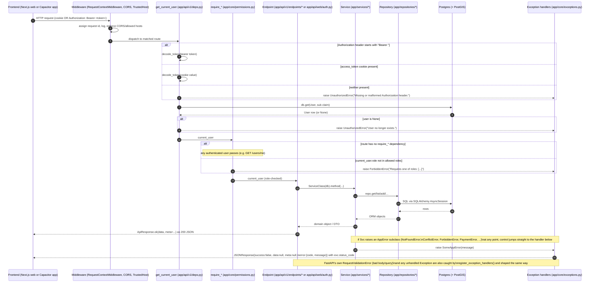
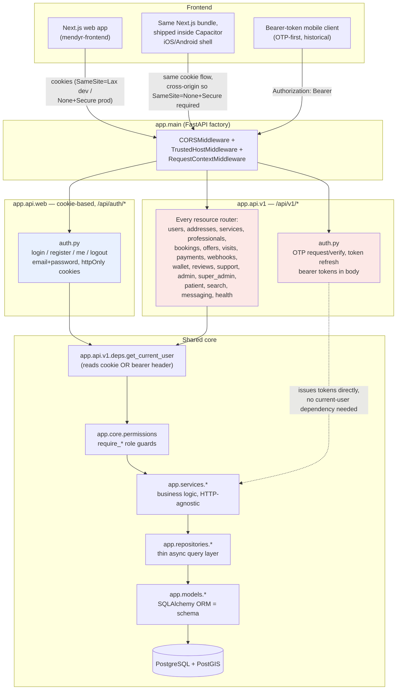

# Mendyr Backend — Request Flow & Router Map

This document complements the top-level `ARCHITECTURE.md` (domain ER diagram, service
responsibilities, folder layout). It does not repeat that content. Instead it covers:

1. What actually happens to one HTTP request, end to end, including where errors get
   intercepted and reshaped.
2. How the two API surfaces (`app/api/web` vs `app/api/v1`) are split and where they converge.
3. Every mounted router, its auth requirement, and — cross-checked against the frontend
   repo (`/Users/salescode/Documents/mendyr-frontend`) — which screen/hook actually calls it
   today.

---

## 1. Request-flow sequence

Two concrete paths are shown together because they diverge only at the auth step: the
Next.js frontend (browser or the same code running inside the Capacitor iOS/Android shell)
always uses the cookie session; a bearer-token caller (historically a native mobile client
integrating directly against the OTP flow) uses the `Authorization` header instead. Both
converge on the same `get_current_user` dependency, the same permission layer, and the same
`ApiResponse` envelope.

Key points grounded in the code:

- **Auth resolution** happens in one place — `get_current_user` in `app/api/v1/deps.py` — for
  *both* schemes. It checks the `Authorization` header first, then falls back to the
  `access_token` httpOnly cookie (`app/core/cookies.py`'s `ACCESS_COOKIE_NAME`). Nothing else
  in the codebase re-implements token parsing.
- **Role checks** are a second, separate dependency layered on top: `require_roles(*allowed)`
  in `app/core/permissions.py` builds `require_patient` / `require_professional` /
  `require_admin` / `require_super_admin` / `require_ops_or_admin` — each just wraps
  `get_current_user` and raises `ForbiddenError` if `current_user.role` isn't in the allowed
  set. A route with only `Depends(get_current_user)` and no `require_*` accepts any
  authenticated role.
- **The envelope** (`app/schemas/common.py::ApiResponse`) is what every `/api/*` route returns
  on success via `ApiResponse.ok(...)`. On failure, `app/core/exceptions.py::_error_body()`
  independently constructs a dict with the exact same shape (`{success, data, meta, error}`)
  so error responses match the success shape without importing the Pydantic schema into the
  exception-handling module (kept dependency-free on purpose, per that file's docstring).
- Three handlers are registered in `register_exception_handlers`: one for the app's own
  `AppError` hierarchy (404/409/422/401/403/429/402 depending on subclass), one for FastAPI's
  `RequestValidationError` (422, `code="validation_error"`), and a catch-all `Exception`
  handler (500, `code="internal_error"`, logged via `logger.exception`).

---

## 2. Component / module split

Both surfaces funnel through the identical `services → repositories → models` stack — a
booking created via a bearer-token client and one created via the cookie-based frontend hit
the exact same `BookingService`/`BookingRepository`/`Booking` model. The only thing that
differs above that layer is how the caller authenticates and how tokens are carried.

---

## 3. Router table

All `app.api.v1` routers are mounted under `settings.API_V1_PREFIX` = `/api/v1`
(`app/main.py`). `app.api.web.auth` is mounted directly under `/api` (not `/api/v1`), so its
routes are `/api/auth/*` — a deliberate exception, called out in `app/main.py`'s own comment,
because that's exactly what the frontend calls.

Note: `admin.py` and `super_admin.py` both declare `prefix="/admin"` — they are two separate
`APIRouter` instances that both land under `/api/v1/admin/*`, split by which role can reach
which sub-path (ops/admin vs. super-admin-only), not by URL prefix.

| Method & path | Auth requirement | Frontend consumer (confirmed via grep) |
|---|---|---|
| `GET /api/v1/healthz` | none | infra/liveness probe only |
| `GET /api/v1/readyz` | none | infra/readiness probe only |
| `POST /api/v1/auth/otp/request` | none (rate-limited 5/min) | no current frontend caller — OTP flow is for the historical bearer-token mobile client, not the Next.js app |
| `POST /api/v1/auth/otp/verify` | none (rate-limited 10/min) | no current frontend caller |
| `POST /api/v1/auth/token/refresh` | none | no current frontend caller |
| `POST /api/auth/login` | none | `src/app/(auth)/login/page.tsx` |
| `POST /api/auth/register` | none | `src/app/(auth)/register/nurse/page.tsx`, `src/app/(auth)/register/patient/page.tsx` |
| `GET /api/auth/me` | any authenticated user (cookie) | `src/hooks/use-auth.ts` |
| `POST /api/auth/logout` | none (clears cookies) | `src/hooks/use-auth.ts` |
| `GET /api/v1/users/me` | any authenticated user | not called directly by the grepped frontend files (the web app uses `/api/auth/me` instead) |
| `PATCH /api/v1/users/me` | any authenticated user | no confirmed frontend caller |
| `POST /api/v1/users/me/devices` | any authenticated user | no confirmed frontend caller (push-token registration, native-client use case) |
| `GET /api/v1/addresses` | any authenticated user | no confirmed caller in grepped files |
| `POST /api/v1/addresses` | any authenticated user | no confirmed caller in grepped files |
| `PATCH /api/v1/addresses/{id}` | any authenticated user | no confirmed caller in grepped files |
| `DELETE /api/v1/addresses/{id}` | any authenticated user | no confirmed caller in grepped files |
| `GET /api/v1/services/categories` | none | catalog/browse screens (not in the grepped hook set) |
| `GET /api/v1/services` | none | catalog/browse screens (not in the grepped hook set) |
| `POST /api/v1/professionals/onboard` | `require_professional` | nurse onboarding flow (not in the grepped hook set) |
| `GET /api/v1/professionals/me` | `require_professional` | nurse profile screens |
| `POST /api/v1/professionals/me/documents/upload-url` | `require_professional` | KYC upload flow |
| `POST /api/v1/professionals/me/documents` | `require_professional` | KYC upload flow |
| `PUT /api/v1/professionals/me/availability/slots` | `require_professional` | nurse availability screen |
| `PATCH /api/v1/professionals/me/availability/status` | `require_professional` | nurse online/offline toggle |
| `GET /api/v1/professionals/me/earnings` | `require_professional` | nurse earnings dashboard |
| `POST /api/v1/bookings/quote` | `require_patient` | booking flow |
| `POST /api/v1/bookings` | `require_patient` | booking flow |
| `GET /api/v1/bookings` | `require_patient` | patient bookings list |
| `GET /api/v1/bookings/professional/mine` | `require_professional` | nurse bookings list |
| `GET /api/v1/bookings/{id}` | any authenticated user | booking detail (patient or assigned professional) |
| `POST /api/v1/bookings/{id}/cancel` | any authenticated user | cancel-booking action |
| `POST /api/v1/offers/{booking_id}/respond` | `require_professional` | nurse accept/reject-offer screen |
| `POST /api/v1/bookings/{id}/en-route` | `require_professional` | nurse visit flow |
| `POST /api/v1/bookings/{id}/check-in` | `require_professional` | nurse visit flow (geofenced) |
| `POST /api/v1/bookings/{id}/check-out` | `require_professional` | nurse visit flow (care note + vitals) |
| `POST /api/v1/payments/orders` | `require_patient` | Razorpay checkout flow |
| `POST /api/v1/payments/verify` | `require_patient` | Razorpay checkout flow |
| `POST /api/v1/webhooks/razorpay` | none (HMAC signature-verified) | Razorpay server-to-server, not the frontend |
| `GET /api/v1/wallet` | any authenticated user | wallet screen |
| `GET /api/v1/wallet/transactions` | any authenticated user | wallet screen |
| `POST /api/v1/reviews` | `require_patient` | post-visit review flow |
| `POST /api/v1/support/tickets` | any authenticated user | support screen |
| `POST /api/v1/support/tickets/{id}/messages` | any authenticated user | support thread screen |
| `GET /api/v1/admin/professionals/pending` | `require_ops_or_admin` | legacy/earlier admin KYC queue (superseded for the current UI by `GET /api/v1/search?entity=nurses`) |
| `POST /api/v1/admin/professionals/{id}/review` | `require_ops_or_admin` | legacy KYC review action |
| `POST /api/v1/admin/nurses/{id}/approve` | `require_admin` | `src/features/admin/useNurses.ts` |
| `POST /api/v1/admin/nurses/{id}/reject` | `require_admin` | `src/features/admin/useNurses.ts` |
| `GET /api/v1/admin/dashboard` | `require_admin` | `WebAdminDashboard.tsx`, `MobileAdminDashboard.tsx`, `WebSuperAdminDashboard.tsx` (same path, both portals) |
| `POST /api/v1/admin/waitlist/{id}/notify` | `require_admin` | waitlist admin screen (mark-notified action) |
| `PATCH /api/v1/admin/contacts/{id}/status` | `require_admin` | `WebAdminContacts` status-update action |
| `GET /api/v1/admin/admins` | `require_super_admin` | `src/features/super-admin/useAdmins.ts` |
| `POST /api/v1/admin/admins` | `require_super_admin` | `src/features/super-admin/useAdmins.ts` |
| `POST /api/v1/admin/admins/{id}/suspend` | `require_super_admin` | `src/features/super-admin/useAdmins.ts` |
| `GET /api/v1/admin/roles` | `require_super_admin` | roles/permissions screen (static data) |
| `GET /api/v1/admin/audit-logs` | `require_super_admin` | `src/features/super-admin/useAuditLogs.ts` |
| `GET /api/v1/admin/settings` | `require_super_admin` | `WebSuperAdminSettings.tsx`, `MobileSuperAdminSettings.tsx` |
| `PUT /api/v1/admin/settings` | `require_super_admin` | `WebSuperAdminSettings.tsx`, `MobileSuperAdminSettings.tsx` |
| `GET /api/v1/patient/dashboard` | `require_patient` | patient dashboard screen |
| `GET /api/v1/patient/profile` | `require_patient` | patient profile screen |
| `PUT /api/v1/patient/profile` | `require_patient` | patient profile screen |
| `GET /api/v1/patient/settings` | `require_patient` | patient settings screen |
| `PUT /api/v1/patient/settings` | `require_patient` | patient settings screen |
| `GET /api/v1/search?entity=...` | `require_admin` | `useNurses.ts`, `usePatients.ts`, `useServices.ts`, `useWaitlist.ts`, `useContacts.ts` — all five call this one path with a different `entity` value (see `app/api/v1/endpoints/search.py`'s docstring) |
| `GET /api/v1/messaging/threads` | any authenticated user | patient/nurse messaging inbox |
| `GET /api/v1/messaging/threads/{id}/messages` | any authenticated user | messaging thread screen |
| `POST /api/v1/messaging/threads/{id}/messages` | any authenticated user | messaging thread screen |
| `POST /api/v1/messaging/threads/for-booking/{id}` | any authenticated user | "message the nurse/patient" entry point from a booking |

**Frontend-called routes with no matching backend route found** (confirmed by grepping every
router file under `app/api/`): the public marketing site calls `POST /api/v1/waitlist`
(`src/app/(public)/page.tsx`) and `POST /api/v1/contacts` (`src/app/(public)/contact/page.tsx`)
to submit a waitlist signup / contact inquiry. No router anywhere in `app/api/v1/api.py`
registers a public `POST /waitlist` or `POST /contacts` path — the only backend routes that
touch those tables are the admin-facing ones (`GET /api/v1/search?entity=waitlist|contacts`,
`POST /api/v1/admin/waitlist/{id}/notify`, `PATCH /api/v1/admin/contacts/{id}/status`). The
`waitlist_entries`/`contact_inquiries` tables exist (migration `004_frontend_schema_additions.sql`),
so the admin read/manage side has something to query once rows exist — but nothing in the
current backend lets a public visitor actually create one. See the "Known Gaps" section of
`docs/BACKEND_FLOWS.md`.

---

## 4. Why two auth systems exist

- **`app/api/v1/endpoints/auth.py`** — phone-OTP request/verify/refresh, bearer tokens
  returned in the JSON body. This is the original mobile-native auth design: no cookies, no
  browser-origin assumptions, a client just stores the access/refresh token itself and sends
  `Authorization: Bearer <token>` on every call. `AuthService.verify_otp_and_authenticate`
  creates the `User` row on first successful verify (signup-on-verify) if `full_name`/`role`
  are supplied, otherwise logs an existing user in.
- **`app/api/web/auth.py`**, mounted at `/api/auth/*` (not `/api/v1/*`) — email + password,
  httpOnly cookies set via `app/core/cookies.py`. This exists specifically to match what the
  Next.js frontend at `/Users/salescode/Documents/mendyr-frontend` actually does: its
  login/register pages and `src/hooks/use-auth.ts` post email+password and expect a session
  cookie, not a bearer token in the body (there is nowhere in that frontend that stores or
  attaches a bearer token). `AuthService.login_with_password` / `AuthService.register` back
  this path, and `_issue_session_cookies` in `app/api/web/auth.py` calls the same
  `create_access_token`/`create_refresh_token` helpers the OTP path uses — same JWTs, same
  `get_current_user` decoder, different transport.
- Both paths write to the same `User` table and are resolved by the same
  `get_current_user` dependency, which checks the `Authorization` header first and falls back
  to the cookie — so a single endpoint (e.g. any `require_patient`-gated route) works
  correctly no matter which frontend called it.
